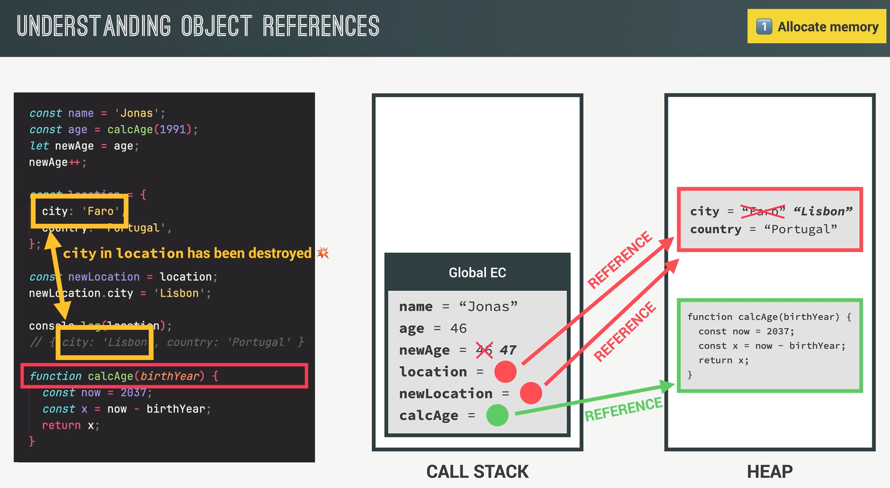

### Memory Lifecycle

- Allocate Memory:
  Variable declaration - JS engine reserves memory for variable
  let a = 7;
- Use Memory
  read - console.log(a)
  write - a = 8;
  update value - a++;
- Release memory
  When value is no longer needed - value deleted

### Data Types:

- primitives - stored in call stack - inside execution context
  - Number
  - Boolean
  - String
  - Undefined
  - NUll
  - Symbol
  - BigInt
- Objects - stored in heap
- References to objects - Stored in call stack

### Releasing Memory

How is memory freed up after we no longer need a value?

- Call stack
  - when the execution context is released from the call stack -> the variable env is deleted
  - variables in the global execution context variable environment are never released while the application is running
- Heap
  - Garabage Collection

### Garbage Collection

- mark and sweep algorithm
  1. Mark phase
     1. for objects in the **roots**, when found mark as 'alive'
     2. Any objects that are not marked as 'alive' are dead
  2. Sweep phase
     1. Delete unmarked objects and reclaim memory for future allocations
- roots:
  - Execution context env vars
  - Active event listeners
  - timers
  - closures

### Memory Leak

when objects that are no longer needeed  
are still reachable (marked as 'alive' by mark & weep algo)  
and will not be garbage collected.
