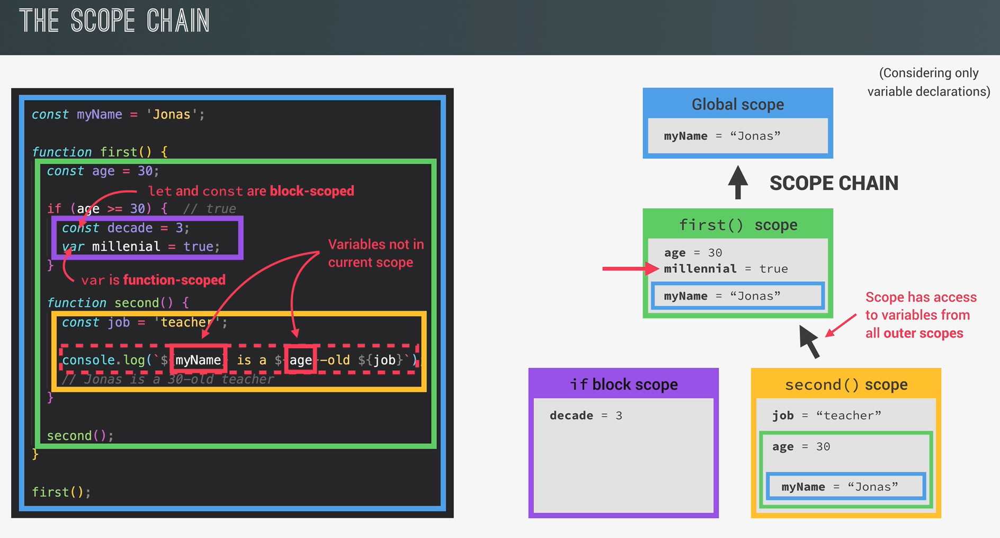
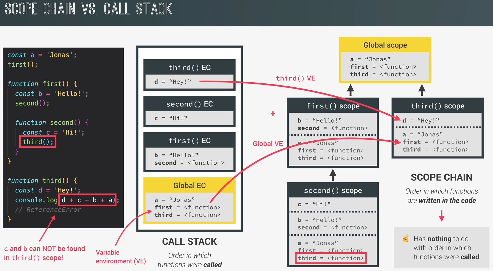

### Scoping

How our program's variables are organized and accessed.  
Where are they stored & where can be accessed from.

### Defn:

- Lexical Scoping - scoping is controlled by the placement of fx & blocks in the code
- Scope of a variable - region of the code where a variable can be accessed.
  Scoping is controlled by placement of fx and blocks in the code

### Scope Types:

- Global scope
  - top level code vars
  - vars defined outside blocks & fxs
- fx scope
  - local scope: vars inside fx are only acessible from within the fx
  -
- block scope
  - Created in ES6
  - if/for block or just a block
  - block scope - only applies to vars created with let and const -> NOT WITH var
- **ReferenceError** if accessing variables outside their scope.

### Arrow Functions

- Don't hav a ref to:
  - arguments
  - this

## Scope Chain

- Variable Lookup:  
  If one scope needs to use a certain variable, but it can't find it in the current scope, it will look at one of its parent scope
- Cannt do opposite direction - "variable lookdown"
- Functions can be defined inside functions

## Scope Chain vs Call Stack

- Lecture 97 - TODO: REWATCH
- **N.B. The scope chain has nothing to do with the order in which functions were called.**
- Execution contexts - var environment
- Its a "one way street"
- Scope chain gets the ve from the execution contexts

- Scope Chain: has nothing to do with order in which fx were called

Exection Context contains:

- var environment
- scope chain
- the this keyword
