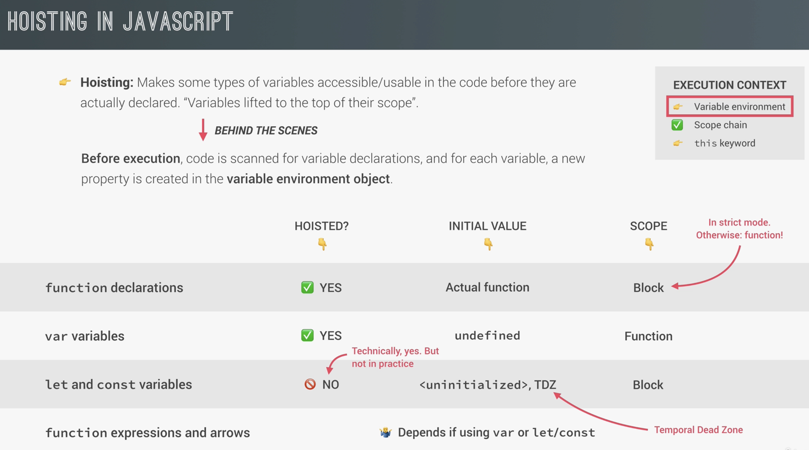
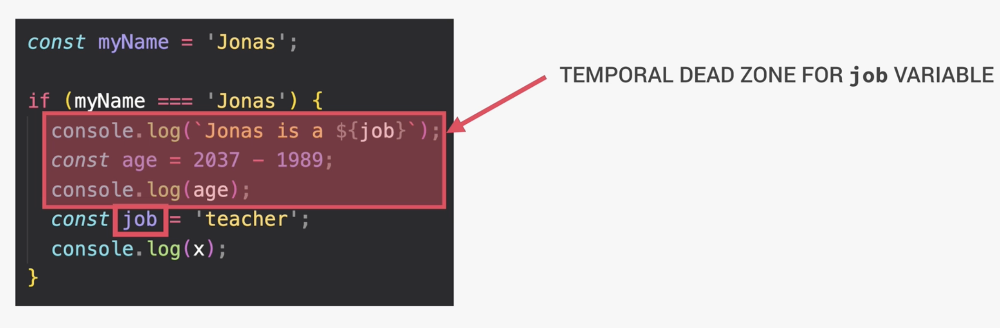
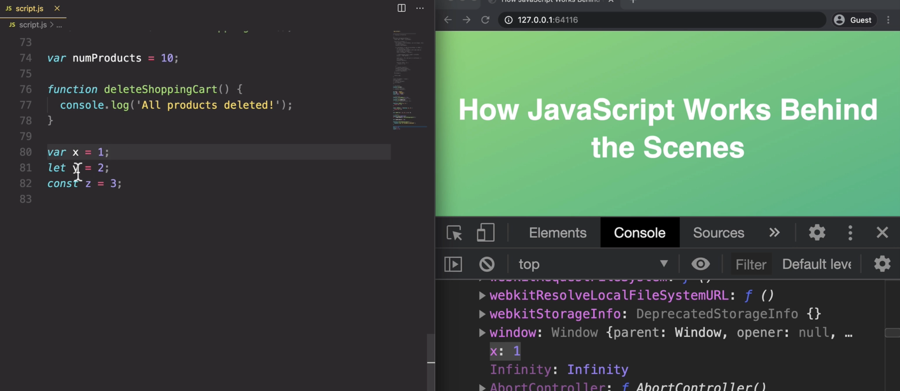

# hoisting

Makes some types of variables  
 **usable in the code**  
 **before they are declared.**

During the creation phase of the execution context:  
the code is scanned for variable declarations.
For each variable declaration a **new property** is added to the **variable environment object**.💥

```javascript
// In code
const a = 8;

const b = () => 8;

// What happens in JS engine, in the background:
var variableEnvironment = {
  a: 8,
  b: () => 8;
};
```

Can use fxs before they are declared.
Can't use fx expressions before they are declared.



Const and Let variables have a TDZ - Temporal Dead Zone  
Accessing const/let variables before they are declared is bad practiced.
🤯 ERROR:  
Cannot access 'x' before initialization  
Const and Let variables are block scoped.  
Var variables are fx scoped.


### Why use let and const instead of var?

var variables when accessed before their declaration have a value of undefined. This can lead to bugs.

let & const variables when accessed before their declaration cause an error:  
🤯 ERROR: Cannot access 'x' before initialization
This is much better to have an error instead of having used a variable when the expected value is not undefined.

Variables defined with var(not const/let) are stored on the 'window' object:

Can access this object by typing window into the dev tools console.
Can refer to the window object by typing window.x
