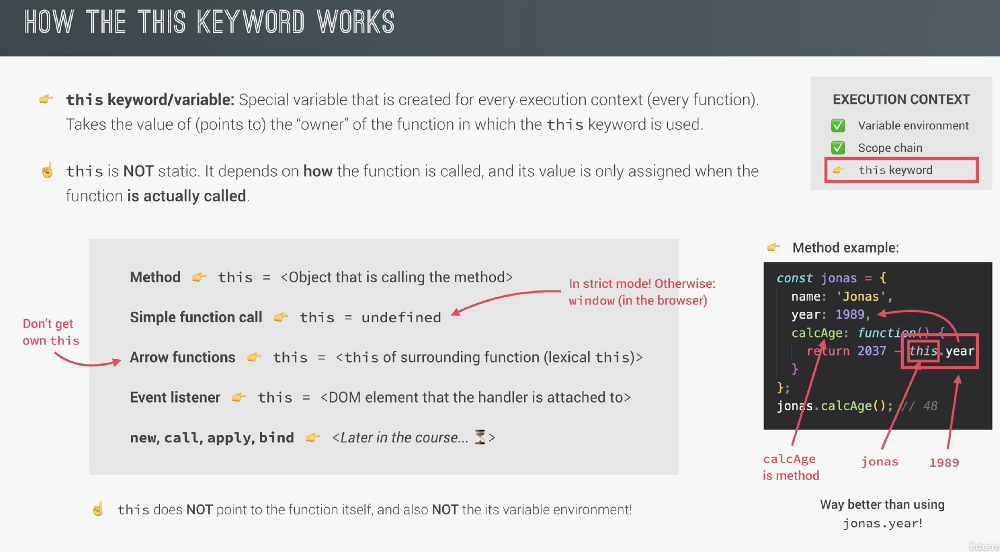
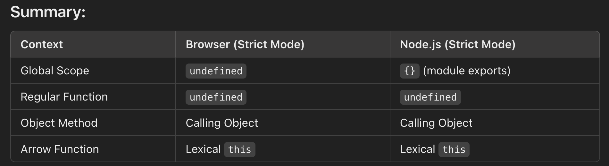

# This Keyword

Points to the owner of the function.  
Its value is assigned at call time of the function.

```javascript
const william = {
    name: 'william',
    birthYear: 1990
  calcAge: () => {2025 - this.birthYear},
};
william.calcAge();
```





A function inside a method is the same as a function not inside an object in that the value of the 'this' keyword is undefined..

Arrow fxs are good to use fxs inside methods.
THey take the this from the surrounding method.
